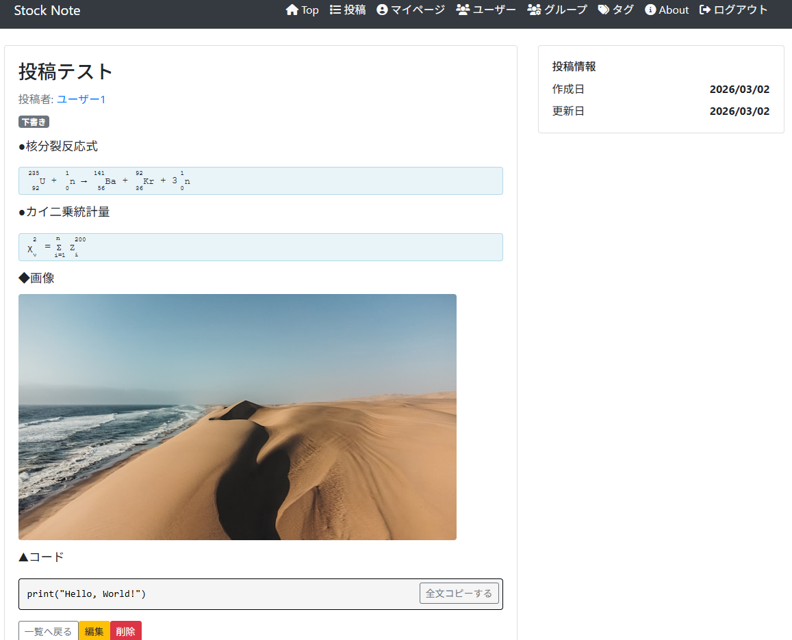
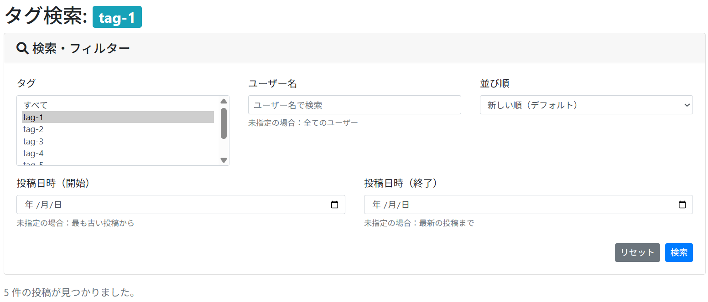

# StockNote

## 概要
StockNoteは技術記事やメモを投稿・共有できる高機能コミュニティサイトです。
数式・コードブロック・画像を含む投稿が可能で、Markdown記法に対応しています。

## 主な特徴
- 📝 Markdown対応の投稿エディタ
- 🔢 数式カード（上付き・下付き・左添え字対応）
- 💻 コードブロック（シンタックスハイライト）
- 🖼️ 複数画像の同時アップロード
- 🏷️ タグ機能による投稿分類
- 🔍 高度な検索機能

## 実装済み機能

### ユーザー機能
- ✅ ユーザー登録・ログイン・ログアウト（Devise）
- ✅ ゲストログイン機能
- ✅ ユーザー検索機能
- ✅ ユーザー管理機能（管理者）

### 投稿機能
- ✅ 投稿の作成・編集・削除
- ✅ 投稿の公開・下書き設定
- ✅ Markdown記法対応
- ✅ 数式カード挿入（上付き・下付き・左添え字）
- ✅ コードブロック挿入（シンタックスハイライト）
- ✅ 複数画像の同時アップロード・埋め込み
- ✅ 統合検索フォーム（投稿一覧・タグ検索・ユーザーページで共通）
- ✅ 複合検索機能（タグ・ユーザー名・投稿日時範囲・ソート順）
- ✅ タグ複数選択検索（初期状態で「すべて」が選択済み）
- ✅ 投稿日時範囲指定（開始日・終了日の23:59:59まで）

### コメント機能
- ✅ コメントの作成・削除
- ✅ コメント管理機能（管理者）

### いいね（ブックマーク）機能
- ✅ いいね機能
- ✅ いいね一覧表示

### グループ（ジャンル）機能
- ✅ グループの作成・編集・削除
- ✅ グループへの参加・退出
- ✅ グループ別投稿表示

## スクリーンショット

### 投稿詳細ページ（数式・画像・コードを含む例）


*数式（上付き・下付き/左・中央・右に対応した添え字対応）、画像埋め込み、コードブロック表示に対応した投稿例。Markdown記法で作成され、XSS対策済みのサニタイズ処理を経て表示されます。*

### 統合検索フォーム


*タグ・ユーザー名・投稿日時範囲・ソート順で複合検索が可能。タグは複数選択可能で、初期状態で「すべて」が選択済み。投稿一覧・タグ検索・ユーザーページで共通のフォームを使用。*

### 投稿エディタの特徴
- **数式カード**: `^`で上付き、`_`で下付き、`[上,下]->`で左添え字
- **コードブロック**: シンタックスハイライト対応
- **画像埋め込み**: ドラッグ&ドロップまたはファイル選択で複数画像を同時アップロード
- **リアルタイムプレビュー**: 編集中の内容をカード形式で即座にプレビュー
- **セキュリティ**: Base64 JSONトークン化保存、XSS対策（html_escape + sanitize）

### 検索機能の特徴
- **統合検索フォーム**: 投稿一覧・タグ検索・ユーザーページで共通
- **複合検索**: タグ（複数選択可）、ユーザー名、投稿日時範囲、ソート順を組み合わせ可能
- **タグ初期選択**: リスト形式で「すべて」が初期状態で選択済みハイライト表示
- **ソート順**: 新しい順・古い順・更新日時・ユーザー名など6種類
- **日時範囲検索**: 終了日は23:59:59まで含む（カスタムpredicate対応）

## 技術スタック

### バックエンド
- Ruby 3.1.2
- Rails 6.1.7
- MySQL2（本番環境）
- SQLite3（開発環境）

### フロントエンド
- JavaScript (ES6+)
- Webpacker 5.4.4
- Turbolinks
- Bootstrap 5

### 主要なGem
- **Devise** - ユーザー認証
- **Ransack** - 高度な検索機能（カスタムpredicate: lteq_end_of_day）
- **Kaminari** - ページネーション
- **acts-as-taggable-on** - タグ機能（Ransack検索対応）
- **Redcarpet** - Markdown→HTML変換
- **ActiveStorage** - ファイルアップロード

### デプロイ
- AWS EC2
- Puma（アプリケーションサーバー）

## セットアップ

### 前提条件
- Ruby 3.1.2
- Rails 6.1.7
- Node.js 14.x以上
- Yarn

### インストール手順

```bash
# リポジトリのクローン
git clone https://github.com/your-username/stock_note.git
cd stock_note

# 依存パッケージのインストール
bundle install
yarn install

# データベースのセットアップ
rails db:create
rails db:migrate
rails db:seed

# アセットのコンパイル（本番環境）
RAILS_ENV=production rails assets:precompile

# 開発サーバーの起動
rails server
```

ブラウザで http://localhost:3000 にアクセス

## テストアカウント

### 管理者
- Email: admin@example.com
- Password: password

### 一般ユーザー1
- Email: user1@example.com
- Password: password

### 一般ユーザー2
- Email: user2@example.com
- Password: password

### ゲストログイン
- トップページの「ゲストログイン」ボタンをクリック

## ディレクトリ構成
```
app/
├── models/          # データモデル
│   └── concerns/    # モデルの共通機能
├── controllers/     # コントローラー
├── views/           # ビュー
├── helpers/         # ヘルパーメソッド
├── javascript/      # JavaScriptファイル
│   ├── packs/       # Webpackエントリーポイント
│   └── posts_editor.js  # 投稿エディタ（数式・コードカード機能）
└── assets/
    └── stylesheets/ # CSSファイル
```

## 今後の拡張案
- フォロー機能
- 通知機能
- ダイレクトメッセージ機能
- プロフィール編集機能
- 投稿のバージョン管理
- コードブロックの言語選択UI
- いいね数・コメント数でのソート機能

ポートフォリオ用プロジェクトとして継続的に機能追加・改善中です。
